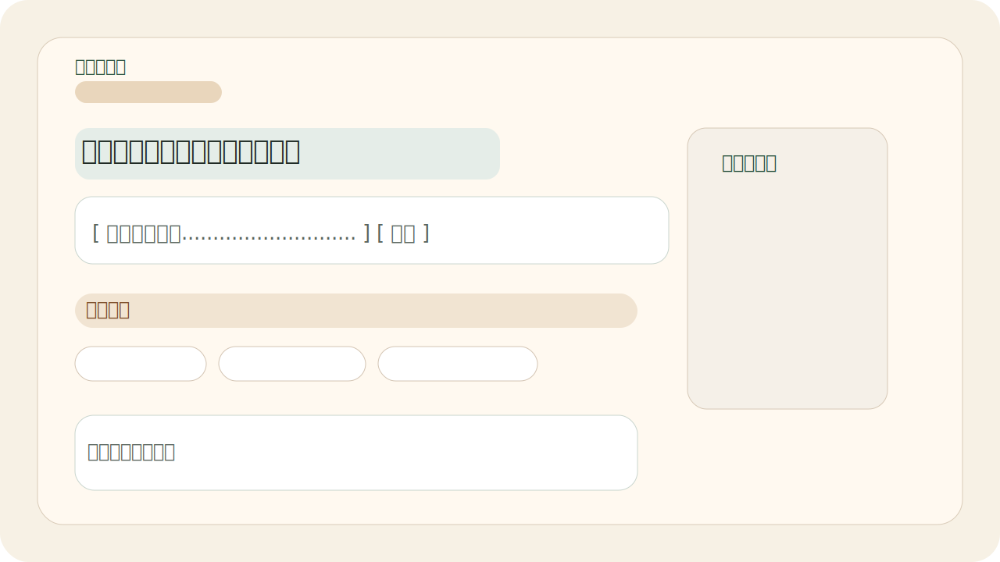
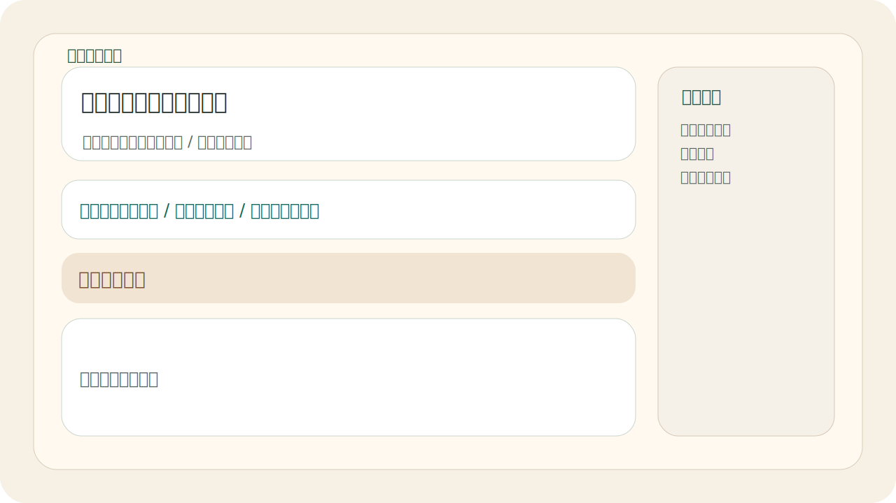

# 校园信息检索与可解释问答助手

副标题：基于 RAG 思路的校园信息检索前端产品原型

面向校园信息查询场景，聚合官方公开信息与社区讨论内容，提供带引用来源、来源分层和检索结果可视化的问答体验。项目重点不在于做一个聊天机器人，而在于把问答结果、检索证据与来源可信度用清晰的前端交互组织出来。




## 项目概览

这是一个 **Next.js App Router + React + TypeScript + Tailwind CSS v4** 的前端产品原型，主题是“校园信息检索与可解释问答助手”。

项目当前定位要点：

- 前端统一通过 `/api/search` 获取 `SearchResponse`
- Route Handler 内部调用 `searchServiceProvider`，再代理到外部搜索服务
- `SearchSource` 已支持来源站点、发布时间、更新时间、抓取时间、最近校验时间和来源新鲜度
- 仓库内已经补齐来源注册表、清洗规则、去重规则和入库表结构骨架，方便接真实数据链路
- 搜索服务可选接入 OpenAI-compatible LLM，把检索片段升级为生成式回答；未配置 key 时自动保持 extractive answer
- Postgres 检索默认走 lexical / pg_trgm；配置 pgvector 与 embedding key 后可启用可选 hybrid retrieval
- 可选接入 cross-encoder rerank；默认关闭，不影响 seed demo 和 Postgres lexical 路径

这个项目适合作为：

- 前端作品集项目
- 可解释 AI / RAG 产品的交互原型
- 面试中讲解状态设计、可信度表达和接口边界的案例

## 当前能力

- 首页输入问题、推荐问题和本地历史记录
- 结果页两阶段 loading
- 回答 / 检索结果双视图切换
- 官方 / 社区来源分层筛选
- 来源卡片展开、原文跳转和关键词高亮
- 来源卡片展示来源站点、发布时间、更新时间、抓取时间和最近校验时间
- 暗色模式切换，偏好会保存在浏览器本地
- 无答案兜底和相关问题推荐
- 统一的 `/api/search` 搜索入口
- `/api/feedback` 保持前端入口不变，但已改为由 `search-service` 统一持久化
- `search-service` 现在额外提供 `/api/query-logs`、增强版 `/health` 和带 `persistent` 聚合的 `/metrics`
- `/health` 现在会额外标记 `databaseRequired` / `telemetryRequired`，区分 seed demo 与真实持久化模式
- 仓库现在内置了 `check:phase-three-ops` 告警检查脚本和 `Ops Health Check` 定时 workflow

## 当前检索链路

浏览器提问后，当前链路是：

`SearchBox / SuggestedQuestions -> /api/search -> searchServiceProvider -> SEARCH_SERVICE_URL -> search-service -> SearchResponse -> ResultsShell -> 回答视图 / 检索视图`

这条链路已经具备“前端只消费统一结果结构”的边界。当前仓库已经包含最小官方来源摄取、保守社区来源摄取、Postgres chunk 检索和可选 pgvector embedding 扩展；但它仍然**不等同于生产级 RAG 平台**，下面这些能力仍需要继续完善：

- 大规模稳定抓取、失败重试和来源合规审计
- BM25 / 评估集驱动的检索质量优化，以及 rerank 效果的真实评估
- 线上监控、告警、限流和缓存策略
- 社区内容的长期质量治理与人工复核流程

这些能力现在通过仓库内的契约文件和文档留好了接口，而不是继续写死在前端页面里。第三阶段第一轮已经把 query log、feedback、service event 的持久化统一收口到 `search-service`，并补上了 `telemetry` 级别的健康检查与运行手册。

## 数据源与更新链路

和真实数据接入直接相关的文件：

- [src/lib/search/source-registry.ts](./src/lib/search/source-registry.ts)：官方 / 社区来源白名单与更新频率模板
- [src/lib/search/ingestion-contract.ts](./src/lib/search/ingestion-contract.ts)：清洗规则、去重规则和入库记录契约
- [docs/data-pipeline.md](./docs/data-pipeline.md)：抓取、清洗、去重、分块、入库和查询映射说明
- [docs/search-storage-schema.sql](./docs/search-storage-schema.sql)：Postgres 表结构草案
- [docs/architecture.md](./docs/architecture.md)：前端边界与上游服务分工

## 技术栈

- Next.js App Router
- React
- TypeScript
- Tailwind CSS v4
- React Context
- Local Storage
- Route Handler API
- External Search Service Contract

## 面试准备重点

推荐把这个项目讲成“可解释 RAG 的前端产品原型”，重点放在：

- 为什么校园信息查询更适合“检索优先”而不是聊天壳子
- 为什么回答必须和来源片段一起展示
- 为什么官方 / 社区来源要分层
- 为什么要把 `resultGeneratedAt` 和来源更新时间分开
- 为什么来源卡片要展示发布时间、更新时间和最近校验时间
- 这个仓库里哪些是前端表达，哪些应该由上游搜索服务负责

详细拆解见 [docs/architecture.md](./docs/architecture.md)。  
数据链路说明见 [docs/data-pipeline.md](./docs/data-pipeline.md)。  
面试讲稿、追问准备和演示脚本见 [docs/interview-notes.md](./docs/interview-notes.md)。

## 本地运行

```bash
npm install
cp .env.example .env.local
npm run verify:search-contract
npm run verify:demo
npm run search-service
npm run dev
```

仓库现在内置了一个最小可用的上游搜索服务，启动 `npm run search-service` 后会在 `http://localhost:8080/api/search` 提供 HTTP 搜索接口。默认 `SEARCH_SERVICE_PROVIDER=auto`：配置 `DATABASE_URL` 时优先读取 Postgres 中的 ingestion chunks；没有数据库时使用本地 seed corpus 作为 demo fallback。无论哪种模式，都继续输出同一条 `SearchResponse` 契约。

`.env.local` 至少需要配置一个可访问的 `SEARCH_SERVICE_URL`。如果上游服务没有准备好，前端会进入错误态，而不会伪装成“无答案”。当前 `web` 已不再要求 `DATABASE_URL`；feedback 和 query log 也统一通过 `SEARCH_SERVICE_URL` 指向的 `search-service` sibling endpoint 代理。

如果本机 `.env.local` 默认带了 `DATABASE_URL`，但你只想验证 seed / demo 路径，可以临时跳过本地 env 文件加载：

```powershell
$env:SEARCH_SERVICE_DISABLE_ENV_FILE='1'
$env:SEARCH_SERVICE_PROVIDER='seed'
$env:SEARCH_SERVICE_URL='http://127.0.0.1:8080/api/search'
node search-service/server.cjs
```

然后在另一个终端执行：

```powershell
$env:SEARCH_SERVICE_URL='http://127.0.0.1:8080/api/search'
$env:OPS_REQUIRE_PERSISTENT='never'
npm run check:phase-three-ops
```

然后访问 [http://localhost:3000](http://localhost:3000)。

### Docker Compose 本地编排

需要一键启动本地 web、search-service 和 Postgres 时：

```bash
npm run compose:up
```

启动后访问：

- 前端：[http://localhost:3000](http://localhost:3000)
- 搜索服务 health：[http://localhost:8080/health](http://localhost:8080/health)
- 搜索服务 metrics：[http://localhost:8080/metrics](http://localhost:8080/metrics)

停止服务：

```bash
npm run compose:down
```

### 可选 LLM 回答

默认回答模式是 `SEARCH_ANSWER_MODE=extractive`，只根据命中的 chunk 片段拼接摘要，不需要任何模型密钥。需要演示生成式 RAG 回答时，可以配置 OpenAI-compatible Chat Completions：

```bash
SEARCH_ANSWER_MODE=llm
LLM_API_KEY=...
LLM_BASE_URL=https://api.openai.com/v1
LLM_MODEL=your-chat-model
```

LLM 只在检索已有来源时调用，提示词要求模型只使用传入 evidence，并返回 `usedSourceIds`。服务会把这些 sourceId 映射回 `SearchAnswer.evidence`，保持前端契约不变；模型调用失败时回退 extractive answer。

### 可选 pgvector embedding

Postgres 检索默认不要求 embedding key，使用 `ILIKE`、`pg_trgm` 和来源权重排序。需要演示 hybrid retrieval 时，先确保 Postgres 支持 pgvector，再运行：

```bash
npm run vector:init
npm run embed:chunks
npm run smoke:vector
```

相关环境变量：

```bash
EMBEDDING_API_KEY=...
EMBEDDING_BASE_URL=https://api.openai.com/v1
EMBEDDING_MODEL=text-embedding-3-small
EMBEDDING_DIMENSIONS=1536
```

未配置 `EMBEDDING_API_KEY` 时，`embed:chunks` 会保持 skip/dry-run 边界，`search-service` 继续使用 lexical retrieval，不会破坏现有 `SearchResponse`。

### 可选 cross-encoder rerank

需要对 Postgres 候选结果做二阶段重排时，可以配置兼容 `/rerank` 的 cross-encoder 服务：

```bash
RERANK_API_KEY=...
RERANK_BASE_URL=https://your-rerank-provider.example.com/v1
RERANK_MODEL=your-rerank-model
RERANK_TOP_K=20
```

search-service 会把候选 chunk 文本发送给 rerank API，并只重排服务端候选顺序；如果 rerank API 失败，会记录 `rerank.failed` 日志并保留原 lexical / hybrid 排序。

## 真实来源 Ingestion v1

仓库现在额外提供了一套 CLI ingestion 闭环，运行在 `search-service/` 下的 TypeScript runtime 中，不改前端查询链路。默认官方同步 5 个官方源，运行时已支持主站、图书馆、教务处、学生处、后勤、就业网、本科招生网和研究生招生网。社区摄取目前只默认启用 `tjcu-tieba`，`tjcu-zhihu` 作为可指定来源，定位是经验补充而不是权威事实来源。

在执行同步前，需要先配置数据库和 ingestion 运行参数：

```bash
DATABASE_URL=postgres://...
SEARCH_SERVICE_PROVIDER=postgres
INGEST_SOURCE_IDS=tjcu-main-notices,tjcu-library,tjcu-academic-affairs,tjcu-undergrad-admissions,tjcu-grad-admissions
INGEST_COMMUNITY_SOURCE_IDS=tjcu-tieba
INGEST_FETCH_LIMIT=12
INGEST_HTTP_TIMEOUT_MS=15000
INGEST_CONCURRENCY=4
INGEST_USER_AGENT=campus-rag-ingestion/1.0 (+https://www.tjcu.edu.cn/)
```

常用命令：

```bash
npm run smoke:search-service
npm run test:unit
npm run test:embedding-client
npm run test:rerank-client
npm run lint
npm run format:check
npm run verify:demo
npm run db:init
npm run ingest:official
npm run ingest:community
npm run ingest:source -- tjcu-main-notices
npm run inspect:ingestion
npm run vector:init
npm run embed:chunks
npm run smoke:vector
npm run smoke:postgres
npm run test:ingestion:unit
npm run test:ingestion:postgres
npm run test:telemetry:postgres
npm run check:phase-three-ops
```

这期已经具备 `documents / document_versions / chunks / ingestion_runs -> search-service -> SearchResponse` 的最小真实数据回路代码。是否已经在当前环境闭合，必须以 `npm run verify:real-data` 或 `npm run smoke:postgres` 的输出为准。重复执行 `npm run ingest:official` 或 `npm run ingest:community` 时，未变化文章只刷新校验时间，不会重复插入相同文档和版本。
`npm run smoke:postgres` 会检查默认官方源是否已有可检索文档和 chunk，并验证一个真实命中 query 与一个预期无命中 query，避免把 seed corpus 或泛词命中误判为真实闭环成功。

`npm run test:ingestion` 现在等同于无数据库单元测试；`npm run test:ingestion:postgres` 明确要求 `DATABASE_URL` 和可连接的 Postgres。`npm run verify:real-data` 会按 `db:init -> ingest:official -> inspect:ingestion -> smoke:postgres -> test:ingestion:postgres` 串起真实数据验收。

`npm run verify:demo` 使用 [fixtures/demo-queries.json](./fixtures/demo-queries.json) 中的固定问题验证 seed 演示闭环；`npm run test:components` 用 Vitest + Testing Library 覆盖核心 React 组件；`npm run e2e` 会启动 seed 搜索服务和 Next.js dev server，覆盖首页搜索、暗色模式、结果页渲染、来源展开、无答案兜底和错误态。

本地 Postgres 启动和真实检索闭环见 [docs/local-postgres.md](./docs/local-postgres.md)。演示 query 与部署边界见 [docs/demo-and-deploy.md](./docs/demo-and-deploy.md)。
第三阶段运维、健康检查、备份恢复和回滚说明见 [docs/phase-three-operations.md](./docs/phase-three-operations.md)。
如果已经有可访问的线上 `search-service`，可以直接用 `npm run check:phase-three-ops` 对 `/health`、`/metrics` 和 `persistent` 阈值做自动检查。

## 后续方向

当前推荐的演进顺序是：

1. 固化本地真实闭环复验：`db:init -> ingest:official -> inspect:ingestion -> smoke:postgres -> /api/search`
2. 配置 `SEARCH_ANSWER_MODE=llm` 做生成式回答演示，并保留无 key 时的 extractive fallback
3. 配置 pgvector embedding，复验 `vector:init -> embed:chunks -> smoke:vector -> hybrid search`
4. 配置 rerank 服务，用固定 query 对比 rerank 前后的命中顺序和答案依据
5. 扩大官方来源 adapter 的实站验证范围，优先保证 3-5 个来源稳定重复同步
6. 对社区来源补合规策略、质量阈值和人工复核记录，再扩大自动摄取范围
7. 在当前 telemetry 基线之上补外部告警平台、来源治理后台和正式发布物料
